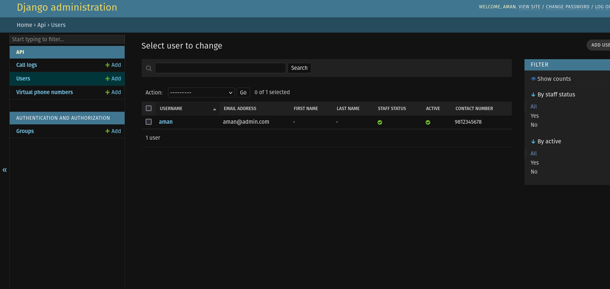
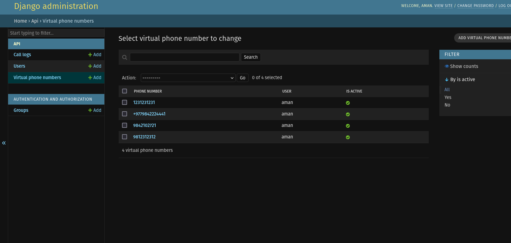
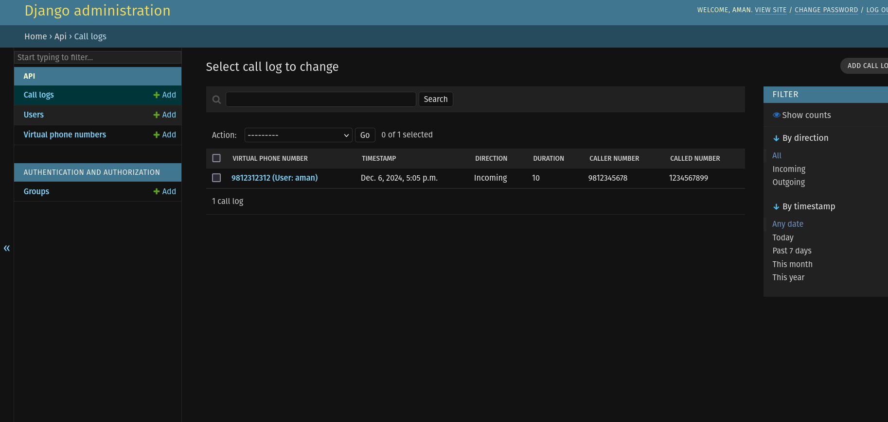
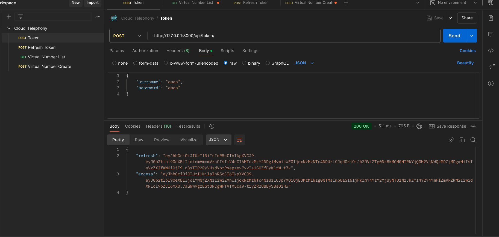
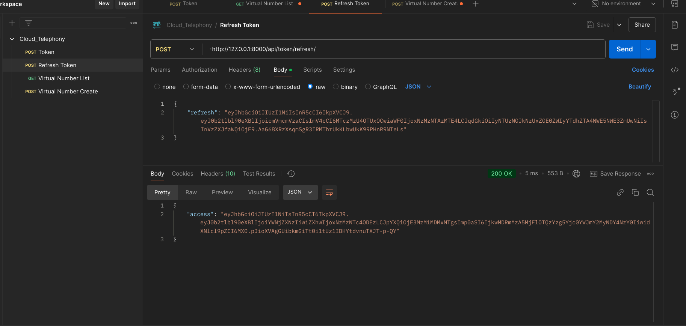
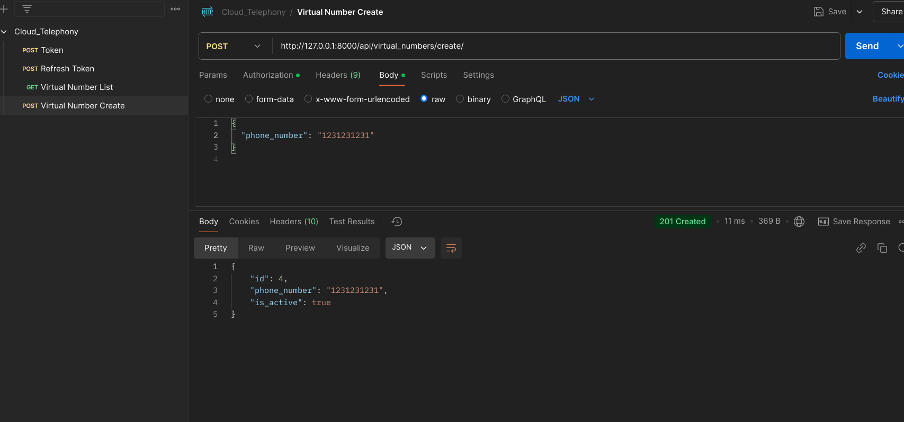

# Cloud Telephony API Development - Solution Breakdown

## Project Overview
This project implements a Cloud Telephony API using Django and Django Rest Framework (DRF) to manage virtual phone numbers with secure authentication.

## Technical Approach

### Authentication Strategy
- Implemented JSON Web Token (JWT) authentication
- Used `rest_framework_simplejwt` for token management
- Created endpoints for:
  - Token generation
  - Token refresh
- Ensures secure, stateless authentication for API interactions

### Database Modeling

#### User Model
- Extended Django's `AbstractUser` to create a custom user model
- Added `contact_number` field with phone number validation
- Allows flexible user management beyond default Django user model


#### Virtual Phone Number Model
- Created to track virtual phone numbers owned by users
- Includes:
  - Unique phone number validation
  - Association with a specific user
  - Active/inactive status tracking
- Enables users to manage multiple virtual numbers


#### Call Log Model
- Tracks detailed call information
- Captures:
  - Call direction (incoming/outgoing)
  - Timestamp
  - Duration
  - Caller and called numbers
- Provides comprehensive call tracking capabilities


### API Endpoints

#### Authentication Endpoints
- `/api/token/`: Obtain JWT token
- `/api/token/refresh/`: Refresh existing token

#### Virtual Phone Number Endpoints
- `/api/virtual_numbers/`: List user's virtual phone numbers
- `/api/virtual_numbers/create/`: Create a new virtual phone number


### Key Implementation Techniques

#### Serialization
- Used Django Rest Framework serializers for:
  - Data validation
  - Phone number uniqueness checks
  - Automatic user association during creation

#### Permissions
- `IsAuthenticated` permission class ensures only logged-in users can:
  - List their virtual numbers
  - Create new virtual numbers

#### Validation
- Implemented custom validation for:
  - Phone number format
  - Preventing duplicate phone numbers
  - Ensuring user-specific number creation

## Design Rationales

### Why This Approach?
1. **Security**: JWT provides secure, stateless authentication
2. **Flexibility**: Custom user and virtual number models allow future extensibility
3. **Separation of Concerns**: Clear separation between models, serializers, and views
4. **Scalability**: Modular design supports easy future enhancements

## Potential Future Improvements
- Implement more advanced call log features
- Add number porting capabilities
- Create more comprehensive reporting mechanisms
- Implement additional security layers
- Add rate limiting for API endpoints

## Challenges Addressed
- Unique phone number validation
- Secure user-specific number management
- Comprehensive call tracking
- Flexible authentication mechanism


# Project Setup and Usage Guide
## Prerequisites

Before running the project, ensure you have the following installed:

- Python 3.12+
- pip (Python package manager)
- Django
- Django REST framework

## Setup

Follow the steps below to get started with the project:

### 1. Clone the Repository

First, clone the repository to your local machine:

```bash
git clone https://github.com/amanpoddar375/Associate-Backend-task-Codavatar.git
cd cloud_telephony
```

### 2. Create a Virtual Environment

```bash
python3 -m venv venv
```
#### i. Activate the virtual environment

on mac
```bash
source venv/bin/activate
```
On windows
```bash
.venv\Scripts\activate
```
### 3. Install Required Packages
```bash
pip install -r requirements.txt

```
### 4. Create a .env File
 Take reference from .env.sample 

    DATABASE_NAME="<name of the database>"
    DATABASE_USER="<name of the role/user>"
    DATABASE_PASSWORD="<db password>"
    DATABASE_HOST="<default is localhost unless set otherwise>"
    DATABASE_PORT="<default is 5432 unless set otherwise>"

### 5. Run Migrations
```bash
python manage.py migrate
```
### 6. Create a superuser:

```bash
python manage.py createsuperuser
```


Go to the Django Admin panel at http://127.0.0.1:8000/admin/ and log in using the superuser credentials.

As you will be using the username and password of the superuser to get the access token

## Authentication and Endpoint Access
#### Step 1: Get the Access Token
- Use `/api/token/`: Obtain JWT token


- Use`/api/token/refresh/`: Refresh existing token


#### Step 2:  Virtual Phone Number Endpoints
- Use `/api/virtual_numbers/`: For listing user's virtual phone numbers


- Use `/api/virtual_numbers/create/`: For creating a new virtual phone number
